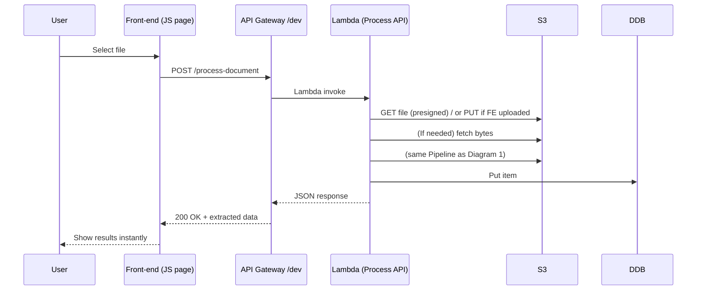

# TaxDoc Microservice Architecture

## 1. Core Backend (OCR Pipeline Only)

```mermaid
flowchart TD
    subgraph S3["S3 Upload Bucket<br><code>taxdoc-uploads-dev-995805900737</code>"]
        U[User uploads<br>PDF / Image]
    end
    S3 -- "ObjectCreated<br>event" --> L[Lambda <br><code>ProcessDocument</code>]
    L --> T[Amazon Textract<br>OCR + AnalyzeExpense/Forms]
    T --> C[Rule-Based Classifier<br>(keyword match)]
    C --> R[Regex Extractor<br>(type-specific fields)]
    R --> DDB[DynamoDB<br><code>TaxDocuments-dev</code>]

    click S3 "https://docs.aws.amazon.com/s3" _blank
    click T  "https://docs.aws.amazon.com/textract" _blank
    click DDB "https://docs.aws.amazon.com/dynamodb" _blank
```

**What happens:**
1️⃣ File lands in S3 → 2️⃣ Lambda fires → 3️⃣ Textract returns raw/structured text → 4️⃣ keywords decide document type → 5️⃣ regex pulls key fields → 6️⃣ JSON record saved in DynamoDB.

## 2. Fullstack Flow (User ↔ Results)



**Why:** Front-end calls the REST endpoint so users get immediate feedback (sync path) yet you still keep the S3-trigger path for bulk/CLI uploads.

## 3. End-to-End Dev → Prod (CI/CD)

```mermaid
flowchart LR
    subgraph Dev["🧑‍💻 Local Dev (VS Code)"]
        A[Code commit<br>(Python + CloudFormation)]
    end
    A --> GH[GitHub Repository]
    GH --> CI[GitHub Actions<br>CI workflow]
    CI -->|lint/test| Pkg[SAM build package]
    CI -->|sam deploy| AWS[TaxDoc AWS Account]

    subgraph AWS["☁️ AWS Prod (taxdoc-stack-dev)"]
        S3[(S3 bucket)]
        T[Textract]
        Lf[Lambda]
        AP[API Gateway]
        DB[(DynamoDB)]
    end
    Pkg -.->|upload| Lf
    CI -.->|update| AP & S3 & DB

    click CI  "https://docs.github.com/actions" _blank
    click AWS "https://console.aws.amazon.com/cloudformation" _blank
```

**CI/CD guarantees** every merge → build → test → deploy without human clicks, so infra & code stay reproducible.

## Component Cheat-Sheet (Why Each Matters)

| Layer | AWS Service | Role in Flow | Why It's the Simplest / Clearest Choice |
|-------|-------------|--------------|------------------------------------------|
| **Storage** | S3 | Durable blob store; emits ObjectCreated to trigger work | 99.999999999% durability, per-object events, pay-per-GB |
| **Compute** | AWS Lambda | Glue & orchestration in Python | Zero-admin, auto-scales, IAM-scoped access to only what it needs |
| **OCR** | Amazon Textract | High-accuracy text + form/expense parsing | Pre-trained—no model maintenance; returns bounding boxes + KV pairs |
| **Classification** | Keyword list in code | Decide document type | Fast to write, transparent, no model-training latency/cost |
| **Field Extraction** | Regex map per doc-type | Pull wages, totals, etc. | Deterministic, passes audits; easy to tweak per new form |
| **Persistence** | DynamoDB | JSON record by DocumentID | Serverless, millisecond reads, flexible schema |
| **API** | API Gateway REST | HTTPS façade, integrates Cognito auth | Built-in throttling, metrics, easy custom domains |
| **Auth (optional)** | Amazon Cognito | JWTs for front-end | Offload passwords/social logins; drop-in token validation |
| **IaC** | CloudFormation/SAM | Declare S3, Lambda, IAM, etc. | One-file diff, version-controlled, repeatable |
| **CI/CD** | GitHub Actions | Test & deploy on every push | Free minutes, simple YAML, secrets stored centrally |

## Current Implementation Status

✅ **Core Pipeline**: S3 → Lambda → Textract → Classification → Extraction → DynamoDB  
✅ **API Gateway**: Synchronous processing endpoint  
✅ **Frontend**: Multiple test interfaces (S3 direct, API-based)  
✅ **Document Types**: W-2, 1099, Receipts, Invoices, Bank Statements  
✅ **Deployment**: CloudFormation/SAM automated deployment  

## Next Steps / Common Enhancements

- **Async Textract** for multi-page PDFs → add SNS + second Lambda
- **Comprehend Custom Classifier** if regex rules miss edge cases  
- **Bedrock** only if you need LLM summaries or fuzzy field extraction
- **CI/CD Pipeline** with GitHub Actions for automated deployments
- **Authentication** with Amazon Cognito for production use

## Testing Your Implementation

### S3 Upload Test
```bash
aws s3 cp your-document.pdf s3://taxdoc-uploads-dev-995805900737/incoming/
```

### API Test
```bash
curl -X POST https://yjj6ifqqxi.execute-api.us-east-1.amazonaws.com/dev/process-document \
  -H "Content-Type: application/json" \
  -d '{"filename": "test-document.pdf"}'
```

### Check Results
```bash
aws dynamodb scan --table-name TaxDocuments-dev --output table
```